---
## Front matter
lang: ru-RU
title: Презентация по лабораторной работе №2
subtitle: Основы информационной безопасности
author:
  - Селиванов В.А.
institute:
  - Российский университет дружбы народов, Москва, Россия
date: 8 марта 2025

## i18n babel
babel-lang: russian
babel-otherlangs: english

## Fonts
mainfont: PT Serif
romanfont: PT Serif
sansfont: PT Sans
monofont: PT Mono
mainfontoptions: Ligatures=TeX
romanfontoptions: Ligatures=TeX
sansfontoptions: Ligatures=TeX,Scale=MatchLowercase
monofontoptions: Scale=MatchLowercase,Scale=0.9

## Formatting pdf
toc: false
toc-title: Содержание
slide_level: 2
aspectratio: 169
section-titles: true
theme: metropolis
header-includes:
 - \metroset{progressbar=frametitle,sectionpage=progressbar,numbering=fraction}
 - '\makeatletter'
 - '\beamer@ignorenonframefalse'
 - '\makeatother'
---

# Информация

## Докладчик

:::::::::::::: {.columns align=center}
::: {.column width="70%"}

  * Селиванов Вячеслав Алексеевич
  * студент группы НКАбд-04-23
  * Российский университет дружбы народов

:::
::: {.column width="30%"}

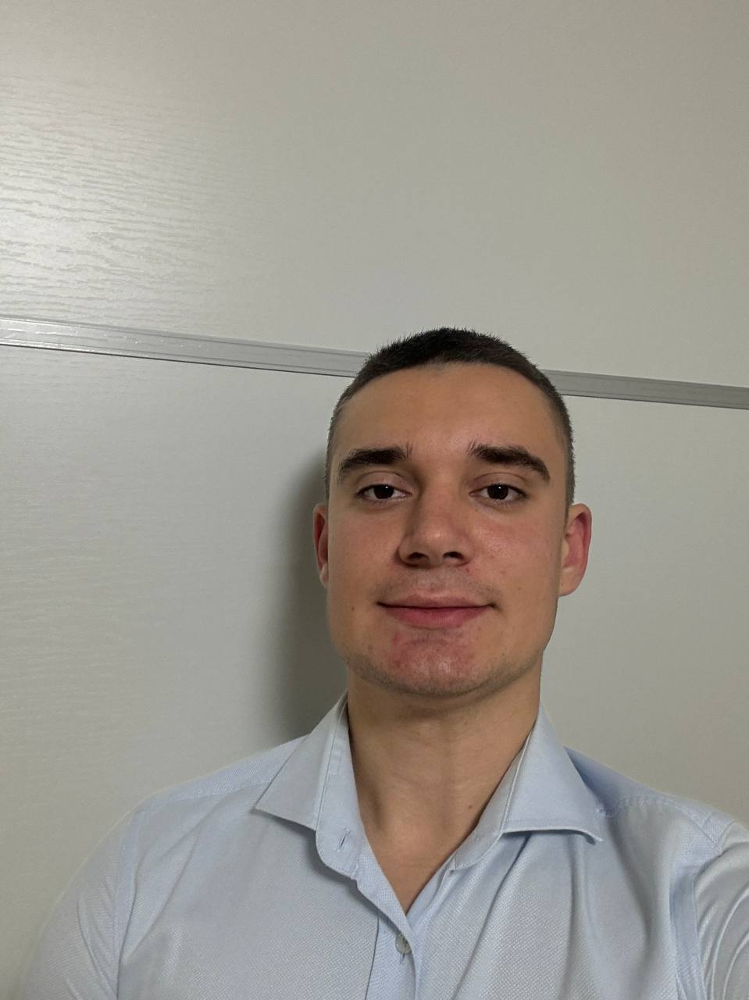

:::
::::::::::::::

## Цель

Получение практических навыков работы в консоли с атрибутами файлов, закрепление теоретических основ дискреционного разграничения доступа в современных системах с открытым кодом на базе ОС Linux

## Задание

1. Работа с атрибутами файлов
2. Заполнение таблицы "Установленные права и разрешённые действия" 
3. Заполнение таблицы "Минимальные права для совершения операций" 

# Выполнение лабораторной работы

## 1

В операционной системе Rocky создаю нового пользователя guest через учетную запись администратора (рис. 1).

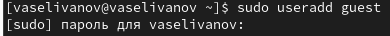{#fig:001 width=70%}

##2

Задаю для нового пользователя guest пароль (рис. 2).

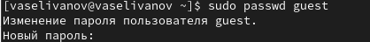{#fig:002 width=70%}

##3

Меняю пользователя в системе на guest. С помощью команды pwd определяю, что нахожусь в директории /home/guest/. Она является домашней, т.к. в приглашении командной строки стоит значок ~(рис. 3).

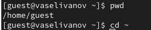{#fig:003 width=70%}

##4

Уточняю имя пользователя(рис. 4).

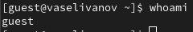{#fig:004 width=70%}

##5

В выводе команды groups информация только о названии группы, команда id даёт намного больше информации (рис. 5).

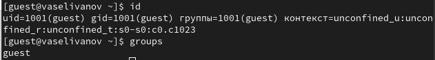{#fig:005 width=70%}

##6

Имя пользователя в приглашении командной строкой совпадает с именем пользователя, которое выводится при команде whoami (рис. 6).

{#fig:006 width=70%}

##7

Получаю информацию о пользователе с помощью команды cat, в выводе получаю коды пользователя и группы, адрес домашней директории (рис. 7).

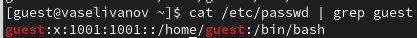{#fig:007 width=70%}

##8

С помощью  команды ls -l получилось увидеть список поддиректорий директории home и права у директории (рис. 8).

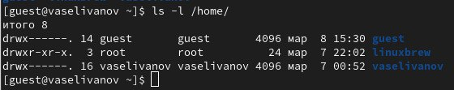{#fig:008 width=70%}

##9

Пытаюсь проверить расширенные атрибуты директорий. Не удалось (рис. 9).

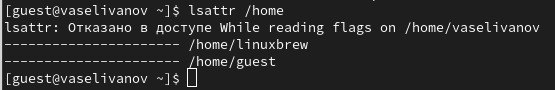{#fig:009 width=70%}

##10

СОздаю поддиректорию dir1 для домашней директории. С помощью команды ls -l смотрю атрибуты (рис. 10).

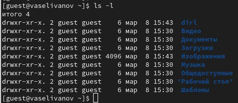{#fig:010 width=70%}

##11

Снимаю атрибуты командой chmod 000 dir1, при проверке видим,что атрибуты действительно сняты (рис. 11).

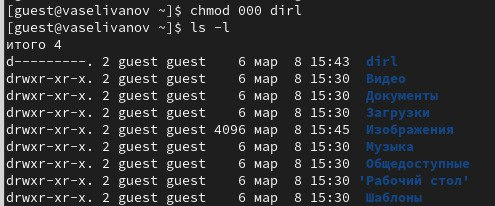{#fig:011 width=70%}

##12

Попытка создать файл в директории dir1. Отказано в доступе. При проверке можно убедиться, что файл действительно не был создан (рис. 12).

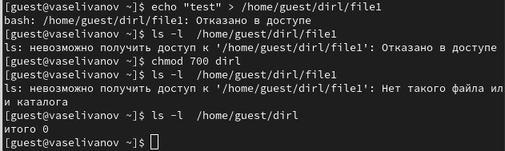{#fig:012 width=70%}

## 13. Заполнение таблицы 2.1

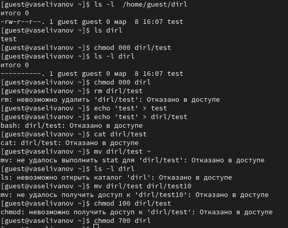{#fig:013 width=70%}

## 14. Таблица 2.2 "Минимальные права для совершения операций"

| | | | | |
|-|-|-|-|-|
|Операция| |Минимальные  права на  директорию| |Минимальные  права на файл|
|Создание файла| |d(300)| |-|
|Удаление файла| |d(300)| |-|
|Чтение файла| |d(100)| |(400)|
|Запись в файл| |d(100)| |(200)|
|Переименование файла| |d(300)| |(000)|
|Создание поддиректории| |d(300)| |-|
|Удаление поддиректории| |d(300)| |-|

## Вывод

Были получены практические навыки работы в консоли с атрибутами файлов, закреплены теоретические основы дискреционного разграничения доступа в современных системах с открытым кодом на базе ОС Linux.

:::
