---
## Front matter
lang: ru-RU
title: Прохождение внешнего курса
subtitle: Безопасность в сети
author:
  - Селиванов В.А
institute:
  - Российский университет дружбы народов, Москва, Россия
  - НКАбд-04-23
date: 17 мая 2025

## i18n babel
babel-lang: russian
babel-otherlangs: english

## Formatting pdf
toc: false
toc-title: Содержание
slide_level: 2
aspectratio: 169
section-titles: true
theme: metropolis
header-includes:
 - \metroset{progressbar=frametitle,sectionpage=progressbar,numbering=fraction}
---

## Докладчик

:::::::::::::: {.columns align=center}
::: {.column width="70%"}

  * Селиванов Вячеслав Алексеевич
  * Студент
  * НКАбд-04-23
  * Российский университет дружбы народов
  * [1132236027@pfur.ru](mailto:1132236027@rudn.ru)

:::
::: {.column width="30%"}

:::
::::::::::::::

## Цели и задачи

Проработать задания, которые касаются безопасности в сети

# Выполнение лабораторной работы

## 

Протокол прикладного уровня

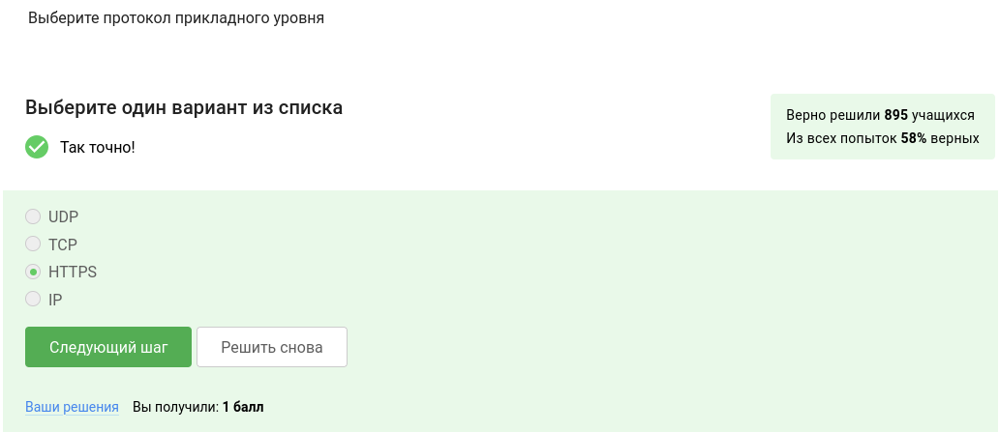

##

Уровень протокола TCP

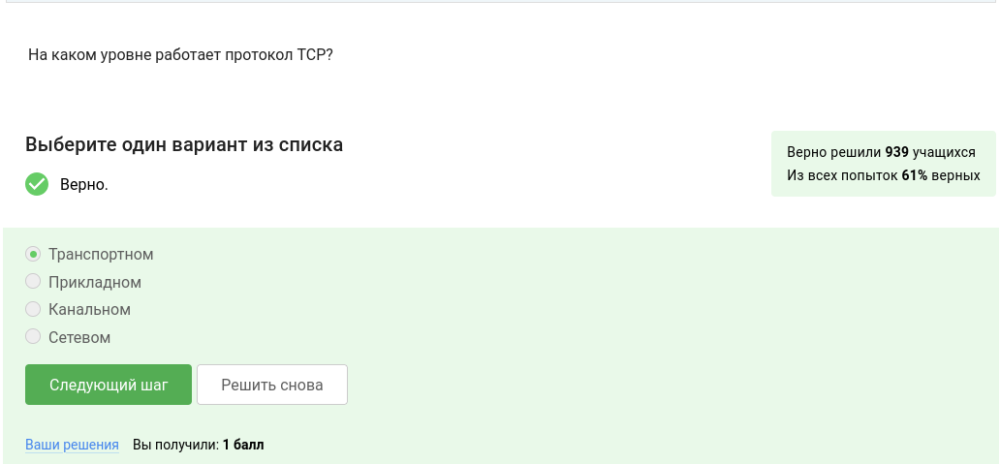

##

Корректные адреса IPv4

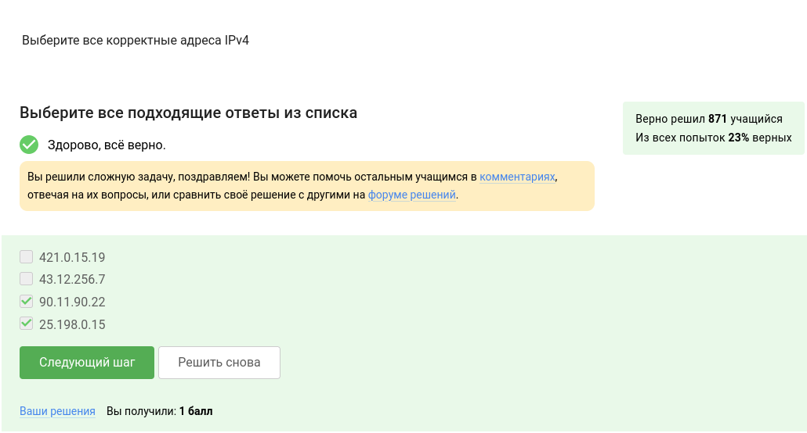

##

DNS сервер 

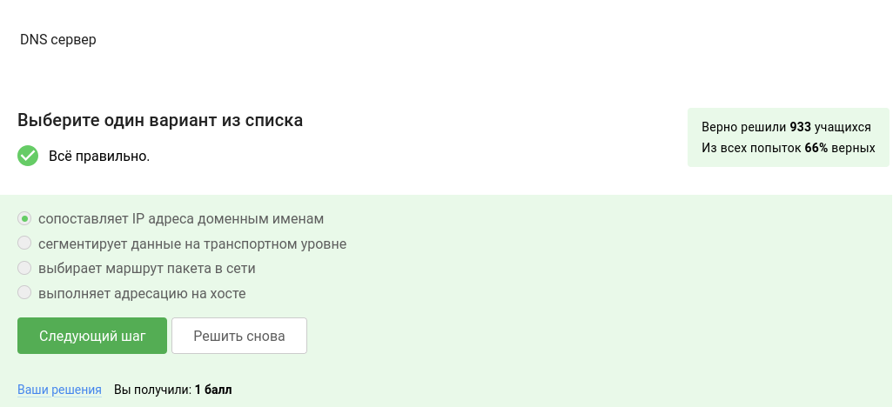

##

Корректная последовательность протоколов в модели TCP/IP

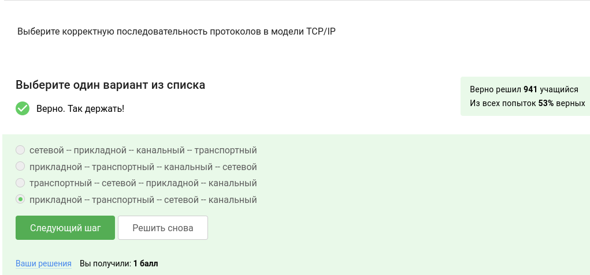

##

Протокол http предполагает

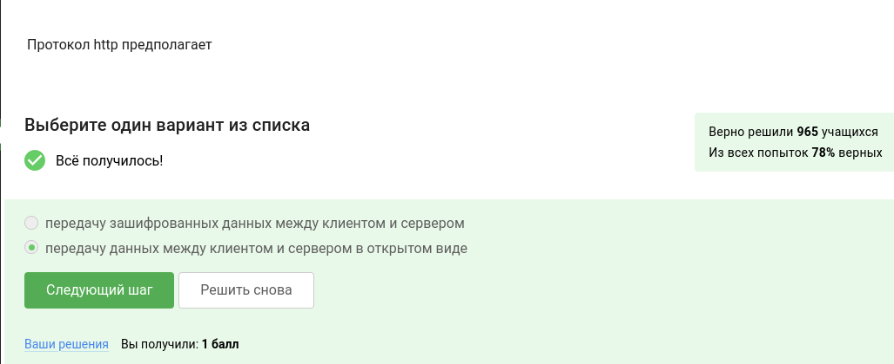

##

Протокол https состоит из ...

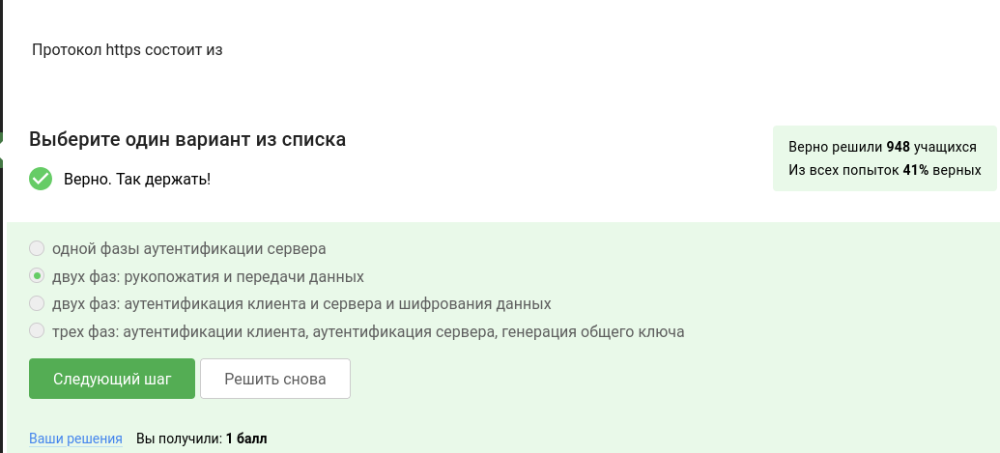

##

Чем определяется версия протокола TLS

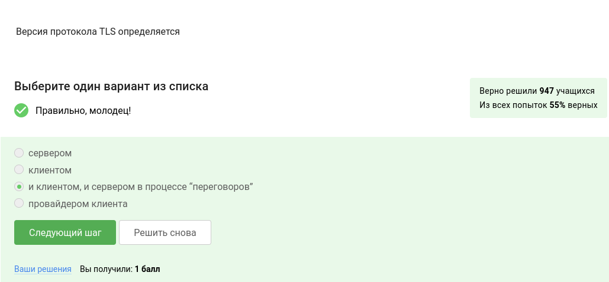

##

В фазе “рукопожатия” протокола TLS не предусмотрено...

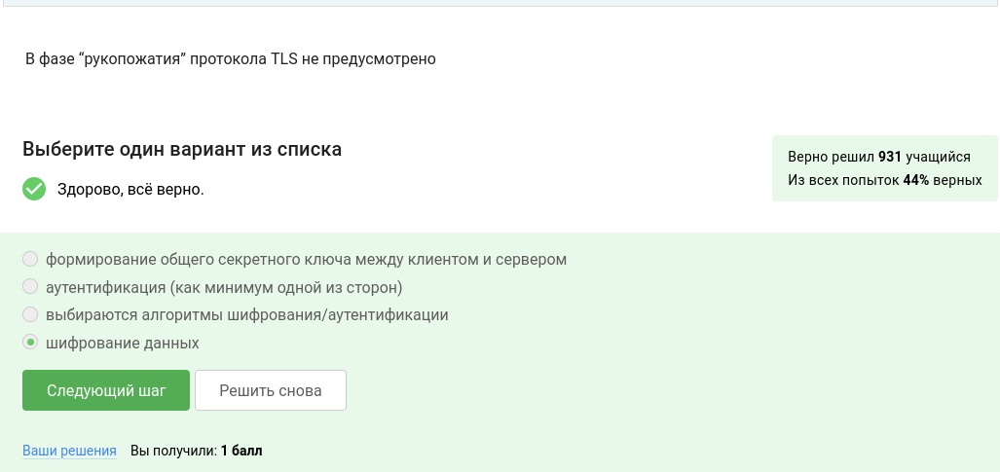

##

Куки хранят...

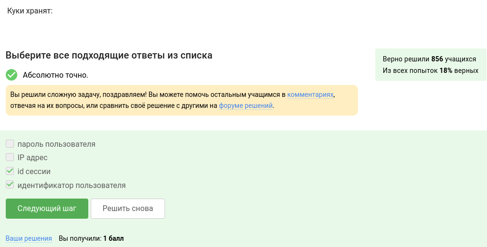

##

Куки не отслеживаются для ...

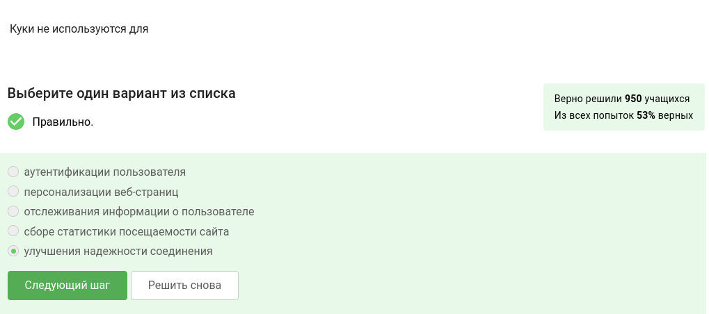

##

Куки генерируются...

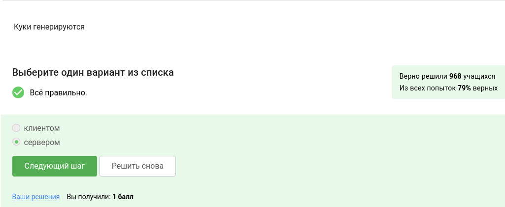

##

Где хранятся сессионные куки...

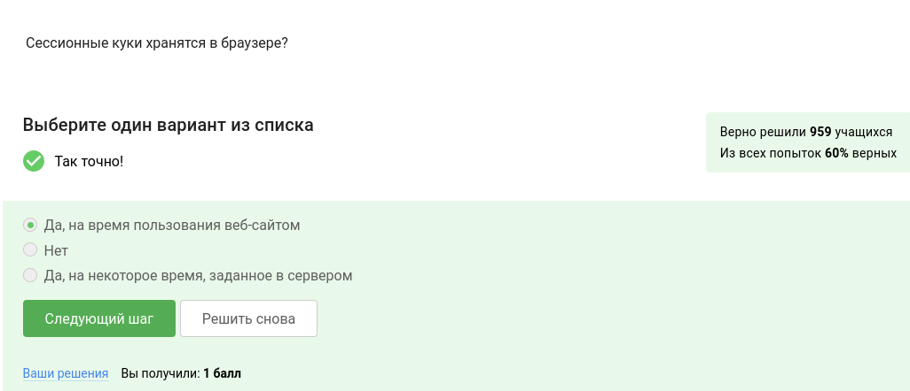

##

Сколько промежуточных узлов в луковой сети TOR?

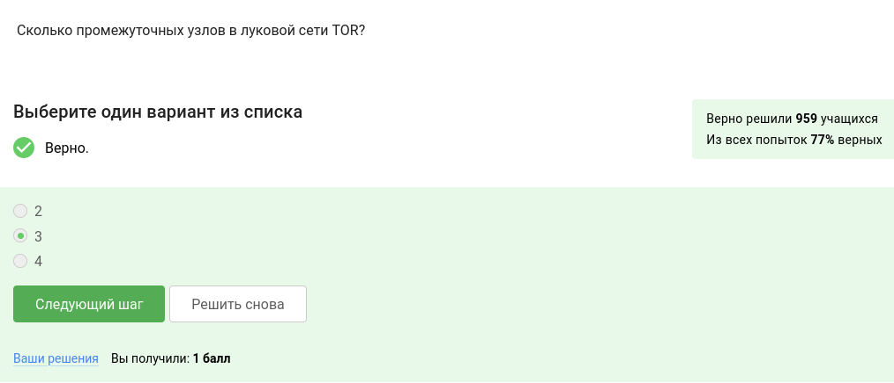

##

IP-адрес получателя известен

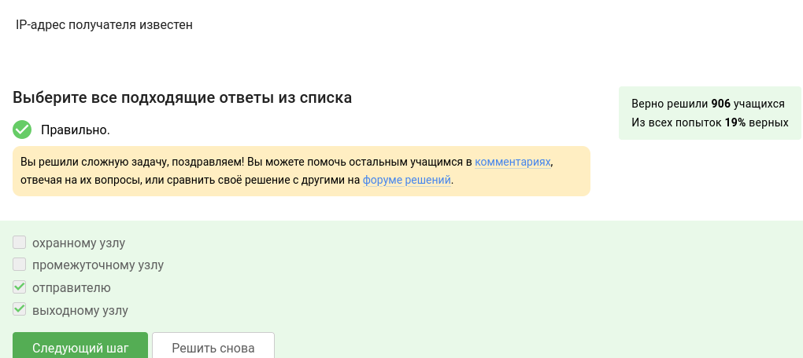

##

Отправитель генерирует общий секретный ключ 

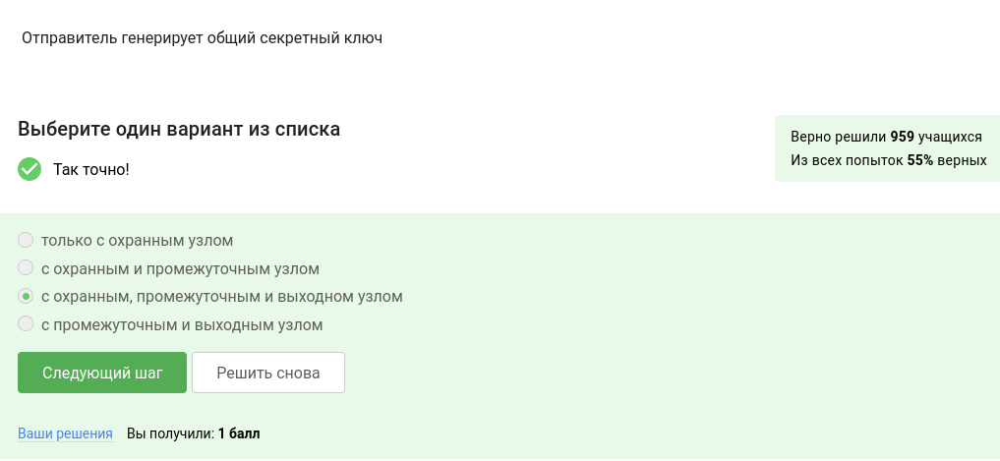

##

Браузер получателя 

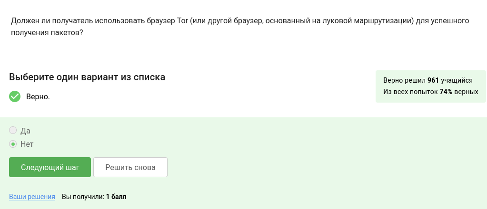

##

Wi-Fi - это 

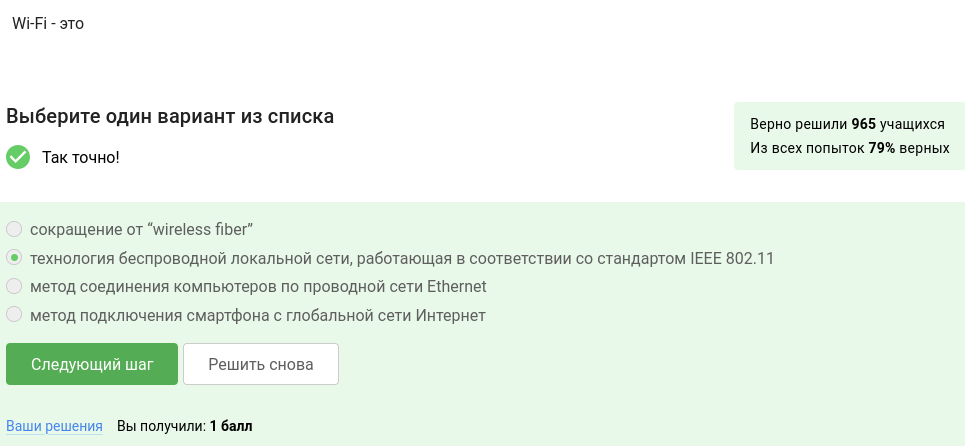

##

Уровень протокола Wi-Fi

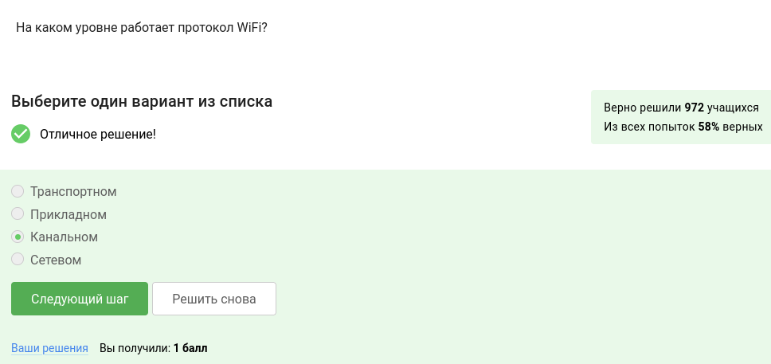

##

Небезопасный метод обеспечения шифрования и аутентификации в сети Wi-Fi

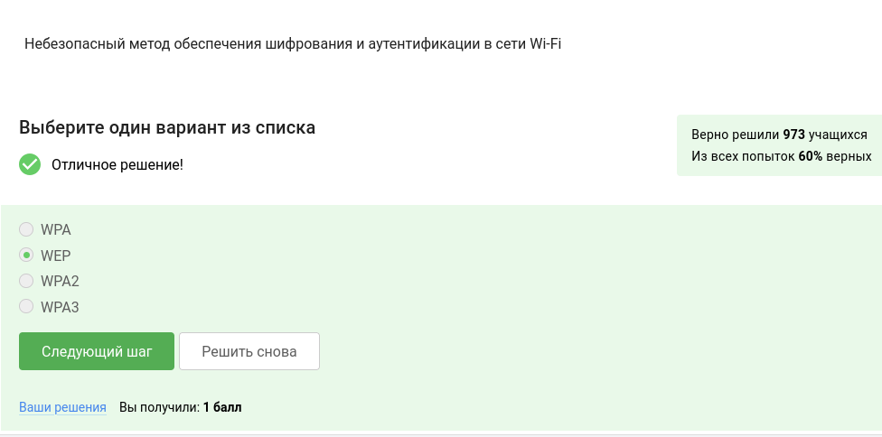

##

Данные между хостом сети (компьютером или смартфоном) и роутером 

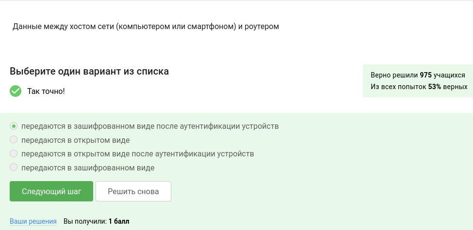

##

Для домашней сети для аутентификации обычно используется метод

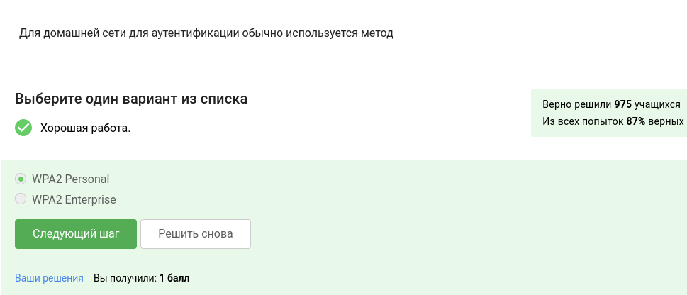

##

## Выводы

Цель работы была достигнута и навыки были получены.

