---
## Front matter
lang: ru-RU
title: Прохождение внешнего курса
subtitle: Защита пк/телефона	
author:
  - Селиванов В.А
institute:
  - Российский университет дружбы народов, Москва, Россия
  - НКАбд-04-23
date: 17 мая 2025

## i18n babel
babel-lang: russian
babel-otherlangs: english

## Formatting pdf
toc: false
toc-title: Содержание
slide_level: 2
aspectratio: 169
section-titles: true
theme: metropolis
header-includes:
 - \metroset{progressbar=frametitle,sectionpage=progressbar,numbering=fraction}
---

## Докладчик

:::::::::::::: {.columns align=center}
::: {.column width="70%"}

  * Селиванов Вячеслав Алексеевич
  * Студент
  * НКАбд-04-23
  * Российский университет дружбы народов
  * [1132236027@pfur.ru](mailto:1132236027@rudn.ru)

:::
::: {.column width="30%"}

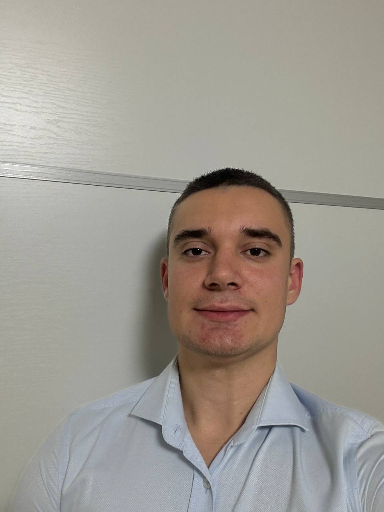

:::
::::::::::::::

## Цели и задачи

Проработать задания, которые касаются защиты устройств

# Выполнение лабораторной работы

## 

Шифровка загрузочного сектора диска 

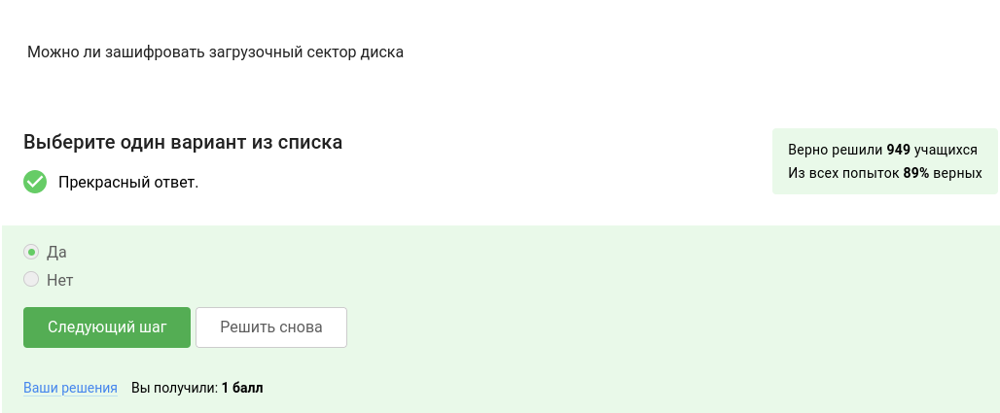

##

Шифрование диска 

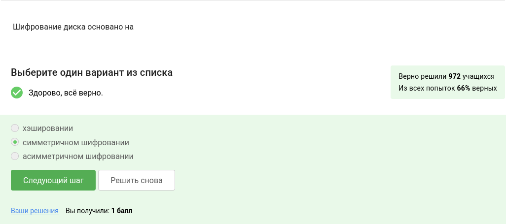

##

Программы,жифрующие жесткий диск 

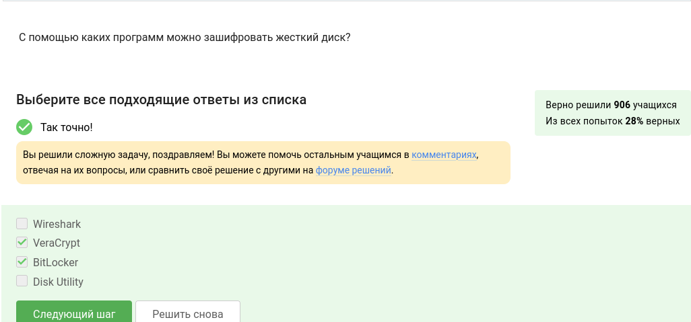

##

Стойкие пароли 

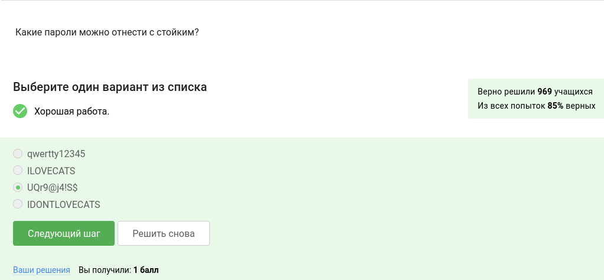

##

Где безопасно хранить пароли

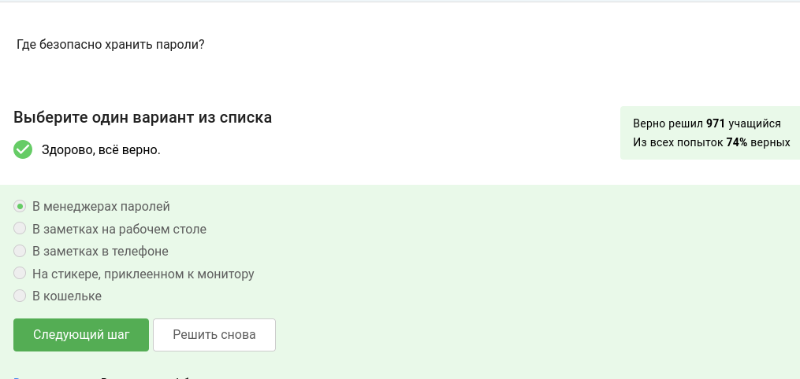

##

Задача капчи 

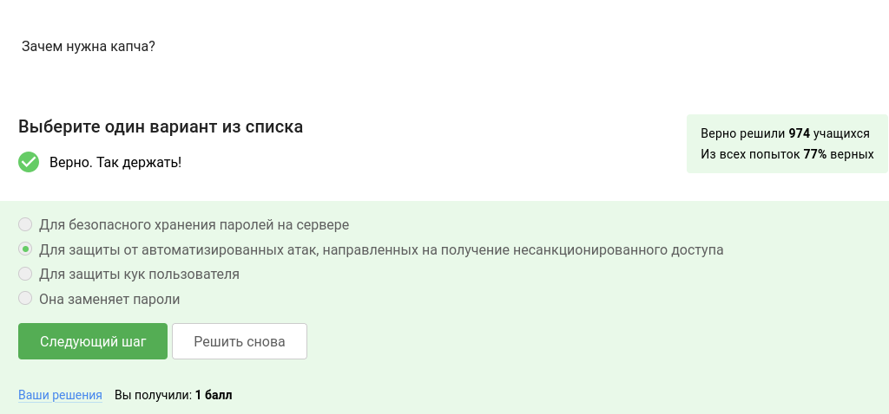

##

Зачем нужно хэширование паролей 

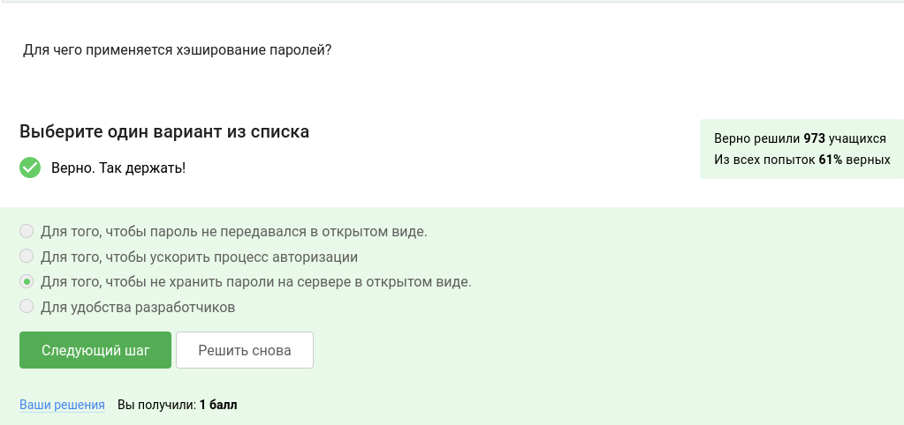

##

Атака протоколов перебором 

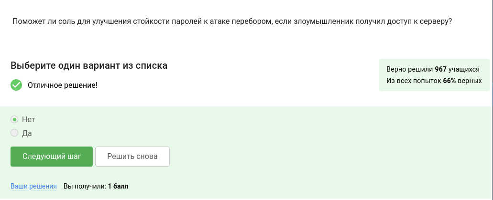

##

Меры безопасности 

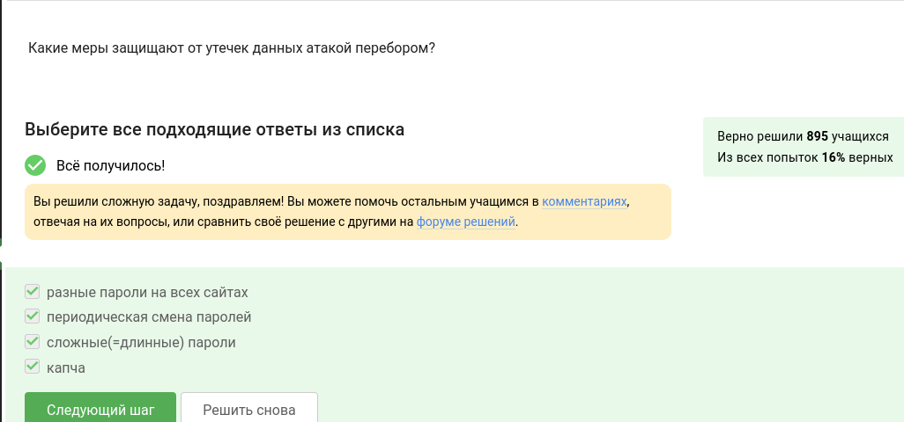

##

Фишинговые ссылки 

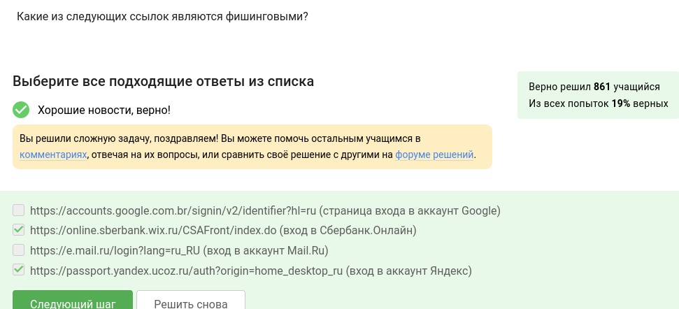

##

Фишинговый email 

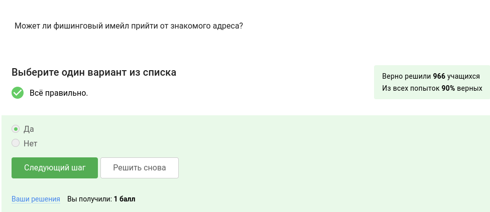

##

Email Спуфинг 

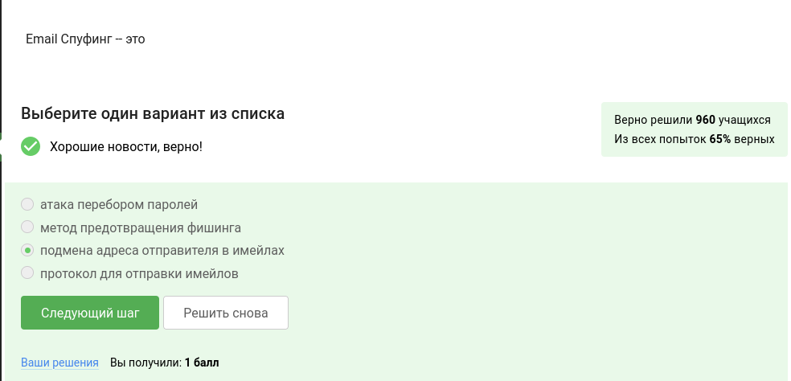

##

Троян 

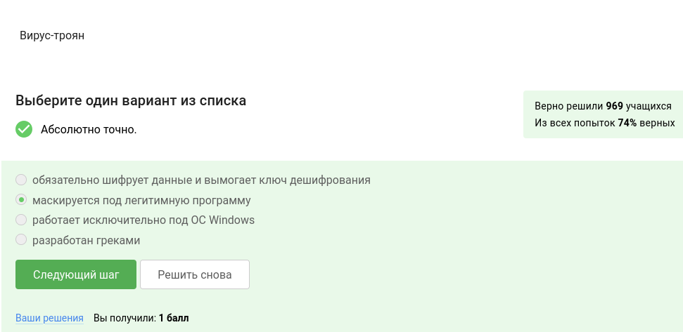

##

Протокол мессенджеров Signal

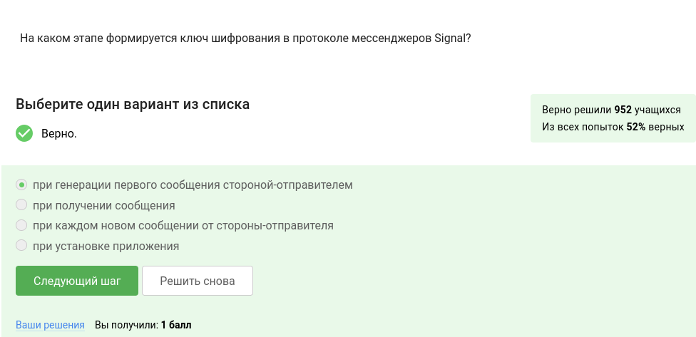

##

Суть сквозного шифрования 

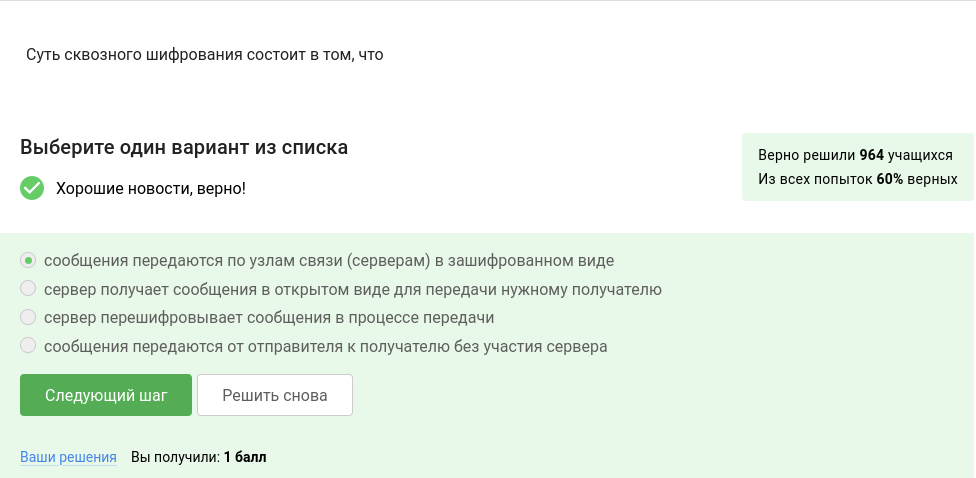

##

## Выводы

Проделаны задания,связаные с защитой устройств

