---
## Front matter
lang: ru-RU
title: Прохождение внешнего курса
subtitle: Криптография на практике
author:
  - Селиванов В.А.
institute:
  - Российский университет дружбы народов, Москва, Россия
  - НКАбд-04-23
date: 17 мая 2025

## i18n babel
babel-lang: russian
babel-otherlangs: english

## Formatting pdf
toc: false
toc-title: Содержание
slide_level: 2
aspectratio: 169
section-titles: true
theme: metropolis
header-includes:
 - \metroset{progressbar=frametitle,sectionpage=progressbar,numbering=fraction}
---

## Докладчик

:::::::::::::: {.columns align=center}
::: {.column width="70%"}

  * Селиванов Вячеслав Алексеевич
  * Студент
  * НКАбд-04-23
  * Российский университет дружбы народов
  * [1132236027@pfur.ru](mailto:1132236027@rudn.ru)

:::
::: {.column width="30%"}

:::
::::::::::::::

## Цели и задачи

Проработать задания, которые касаются криптографии

# Выполнение лабораторной работы

Ассимитричные криптографические примитивы 

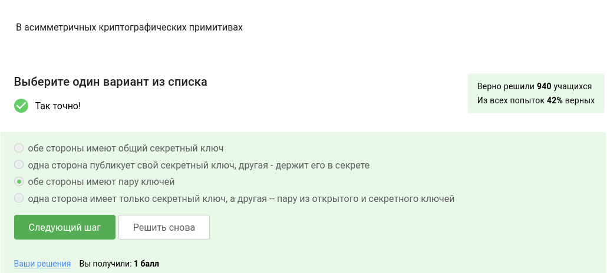

##

Хэш-функция 

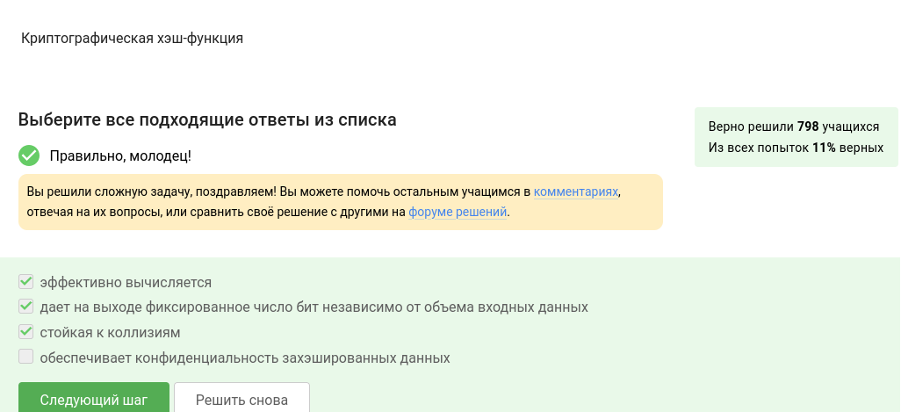

##

Алгоритмы цифровой подписи 

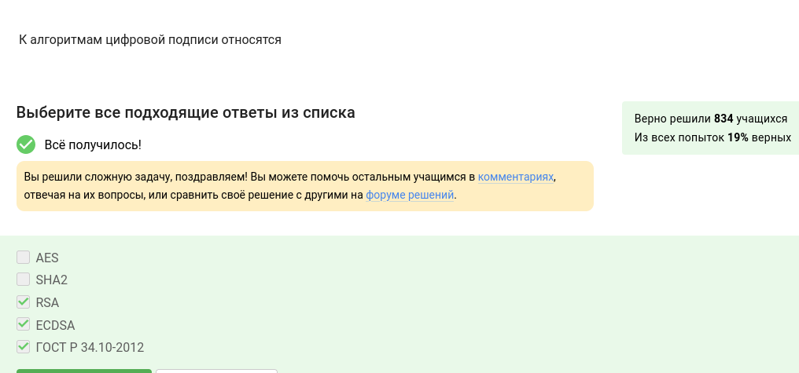

##

Код аунтетификации сообщения 

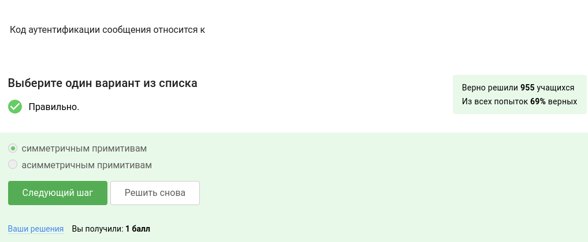

##

Обмен ключами Диффи-Хэлмана 

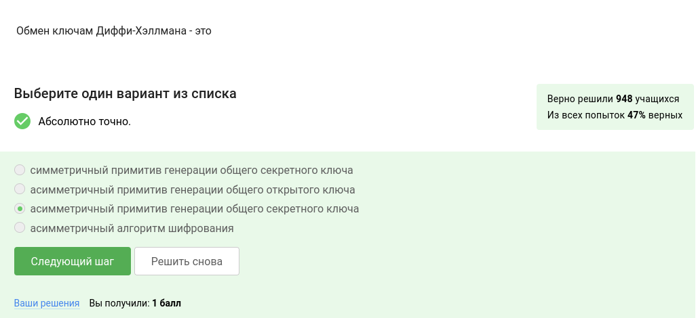

##

Протокол электронной цифровой подписи 

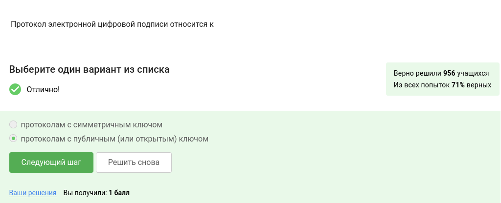

##

Алгоритм верификации электронной цифровой подписи 

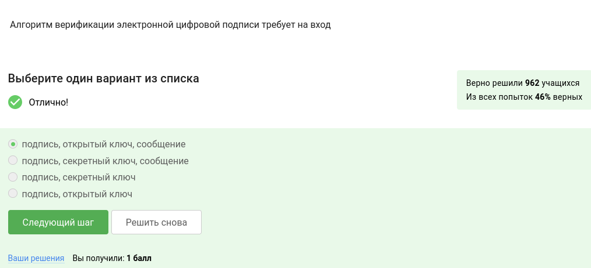

##

Подпись

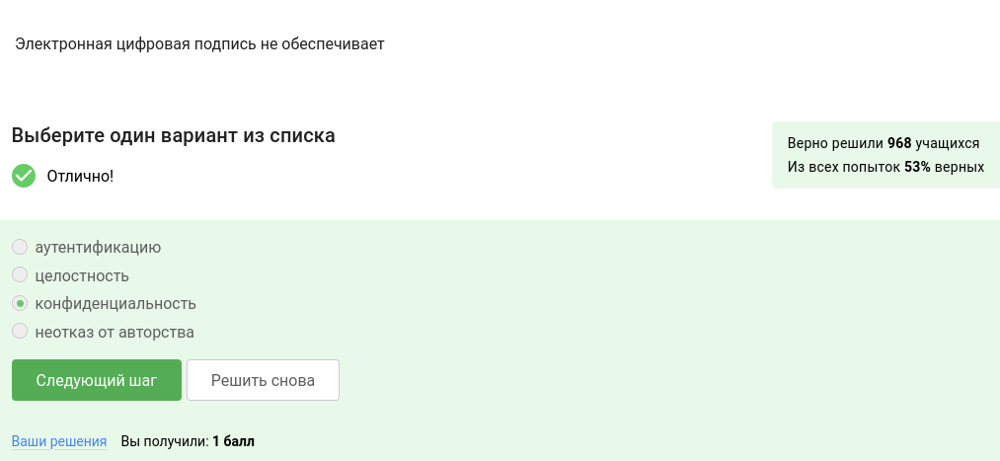

##

Тип сертификата электронной подписи в ФНС 

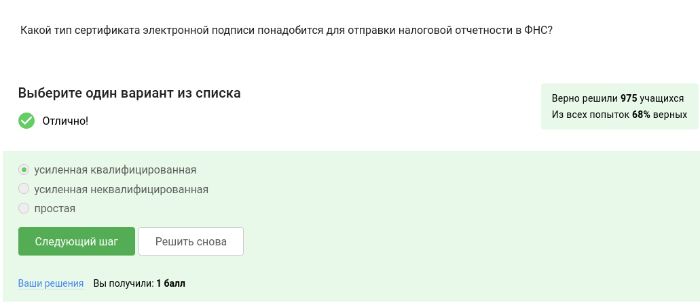

##

Организация 

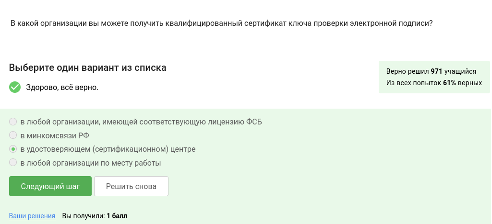

##

Платежные системы 

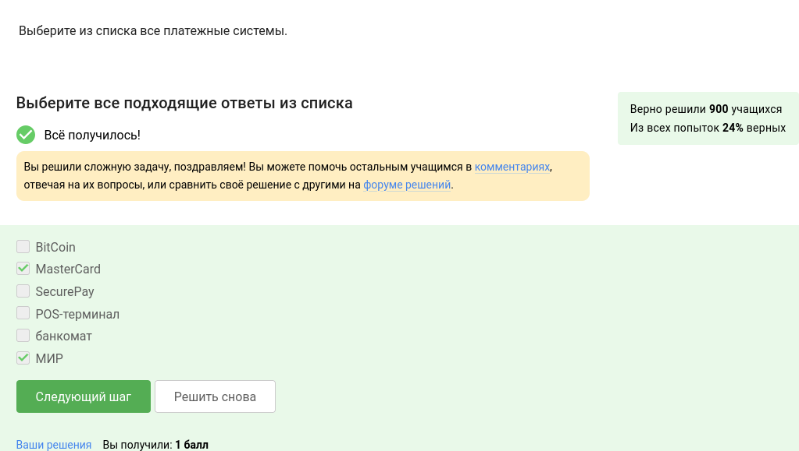

##

Многофакторная аунтетификация 

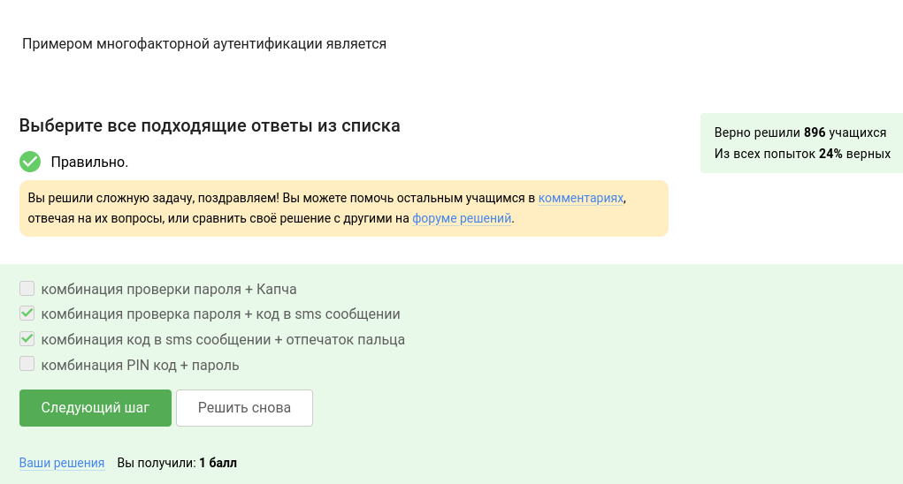

##

Онлайн платежи сегодня 

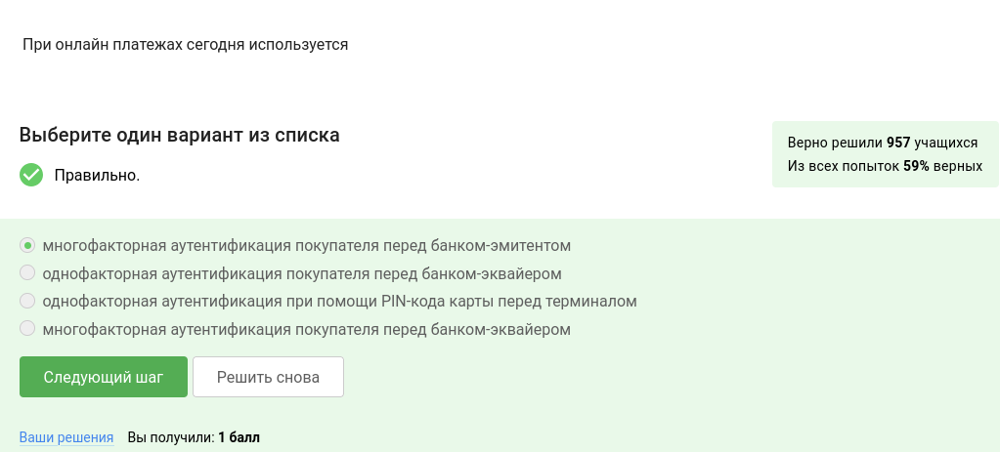

##

Свойство криптографичской хэш-функции 

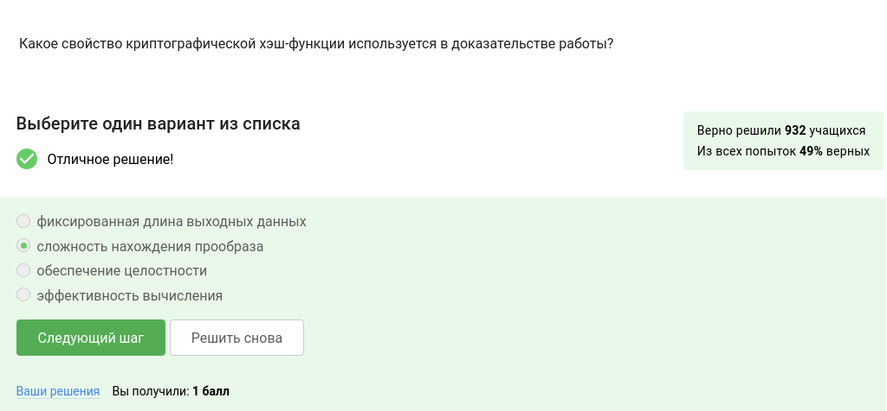

##

Свойства консенсуса в системах блокчейн 

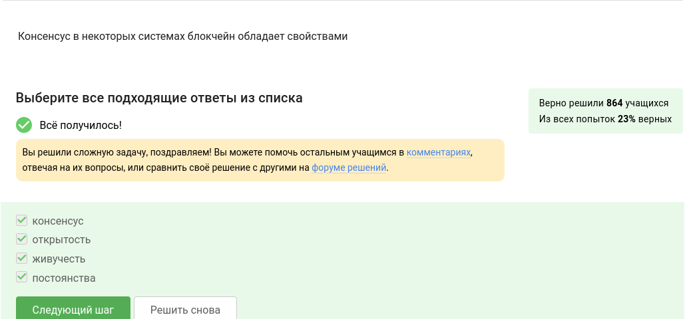

##

Секретные ключи 

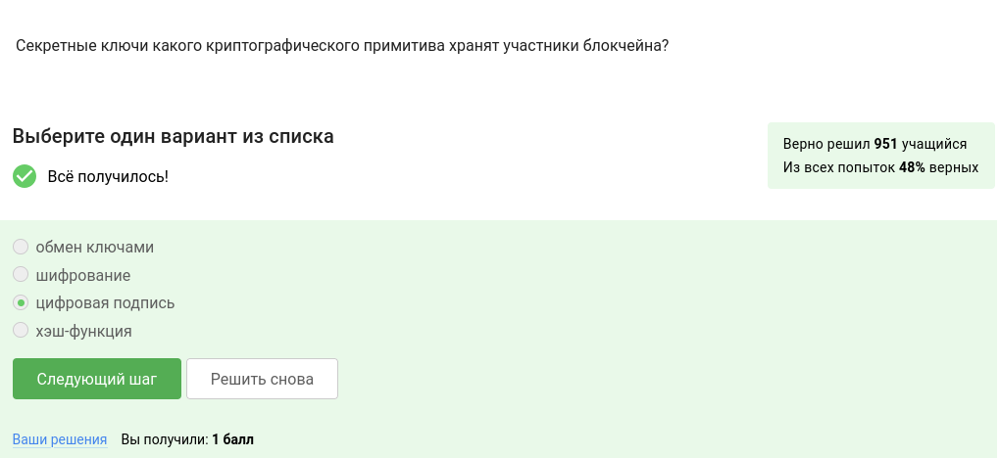

##

## Выводы

Проделаны задания,связаные с криптографией

