---
## Front matter
title: "Прохождение внешнего курса"
subtitle: "Безопасность в сети"
author: "Селиванов Вячеслав Алексеевич"

## Generic otions
lang: ru-RU
toc-title: "Содержание"

## Bibliography
bibliography: bib/cite.bib
csl: pandoc/csl/gost-r-7-0-5-2008-numeric.csl

## Pdf output format
toc: true # Table of contents
toc-depth: 2
lof: true # List of figures
lot: true # List of tables
fontsize: 12pt
linestretch: 1.5
papersize: a4
documentclass: scrreprt
## I18n polyglossia
polyglossia-lang:
  name: russian
  options:
	- spelling=modern
	- babelshorthands=true
polyglossia-otherlangs:
  name: english
## I18n babel
babel-lang: russian
babel-otherlangs: english
## Fonts
mainfont: IBM Plex Serif
romanfont: IBM Plex Serif
sansfont: IBM Plex Sans
monofont: IBM Plex Mono
mathfont: STIX Two Math
mainfontoptions: Ligatures=Common,Ligatures=TeX,Scale=0.94
romanfontoptions: Ligatures=Common,Ligatures=TeX,Scale=0.94
sansfontoptions: Ligatures=Common,Ligatures=TeX,Scale=MatchLowercase,Scale=0.94
monofontoptions: Scale=MatchLowercase,Scale=0.94,FakeStretch=0.9
mathfontoptions:
## Biblatex
biblatex: true
biblio-style: "gost-numeric"
biblatexoptions:
  - parentracker=true
  - backend=biber
  - hyperref=auto
  - language=auto
  - autolang=other*
  - citestyle=gost-numeric
## Pandoc-crossref LaTeX customization
figureTitle: "Рис."
tableTitle: "Таблица"
listingTitle: "Листинг"
lofTitle: "Список иллюстраций"
lotTitle: "Список таблиц"
lolTitle: "Листинги"
## Misc options
indent: true
header-includes:
  - \usepackage{indentfirst}
  - \usepackage{float} # keep figures where there are in the text
  - \floatplacement{figure}{H} # keep figures where there are in the text
---

# Цель работы

Проработать задания, которые касаются безопасности в сети

# Выполнение лабораторной работы

Протокол прикладного уровня (рис. [-@fig:001]).

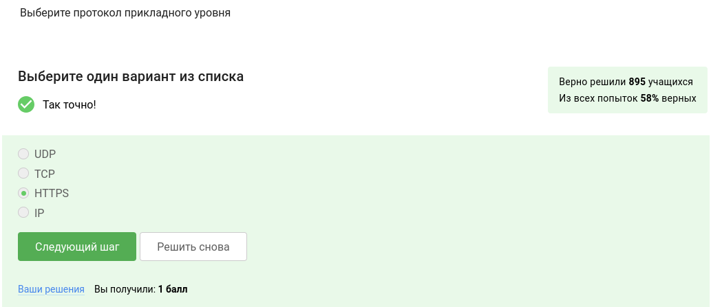{#fig:001 width=70%}

Уровень протокола TCP (рис. [-@fig:002]).

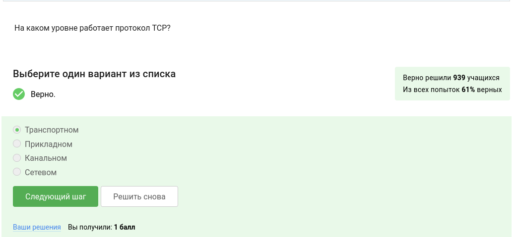{#fig:002 width=70%}

Корректные адреса IPv4 (рис. [-@fig:003]).

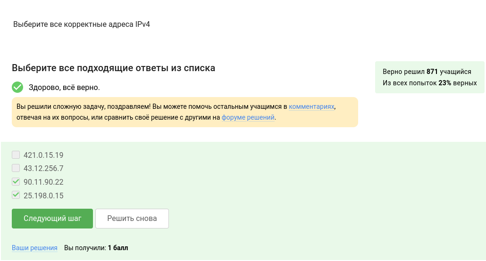{#fig:003 width=70%}

DNS сервер (рис. [-@fig:004]).

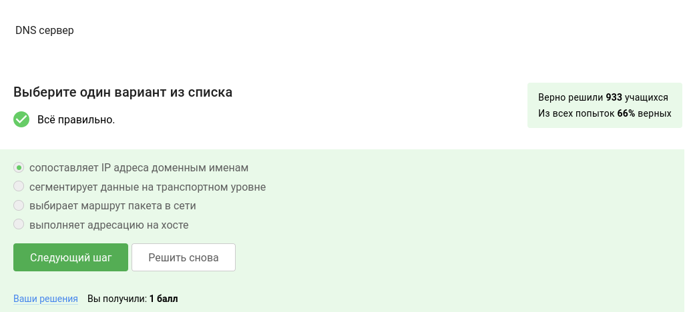{#fig:004 width=70%}

Корректная последовательность протоколов в модели TCP/IP (рис. [-@fig:005]).

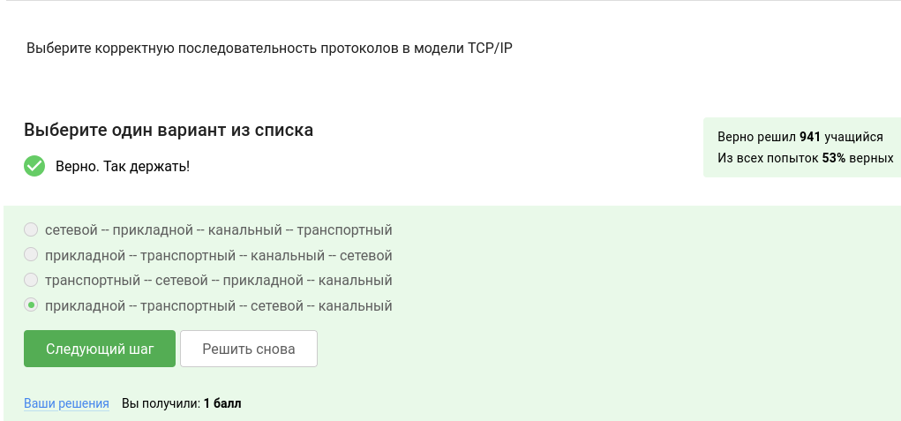{#fig:005 width=70%}

Протокол http предполагает (рис. [-@fig:006]).

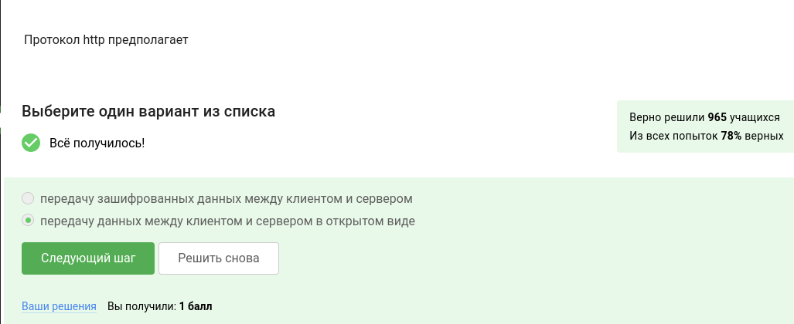{#fig:006 width=70%}

Протокол https состоит из ... (рис. [-@fig:007]).

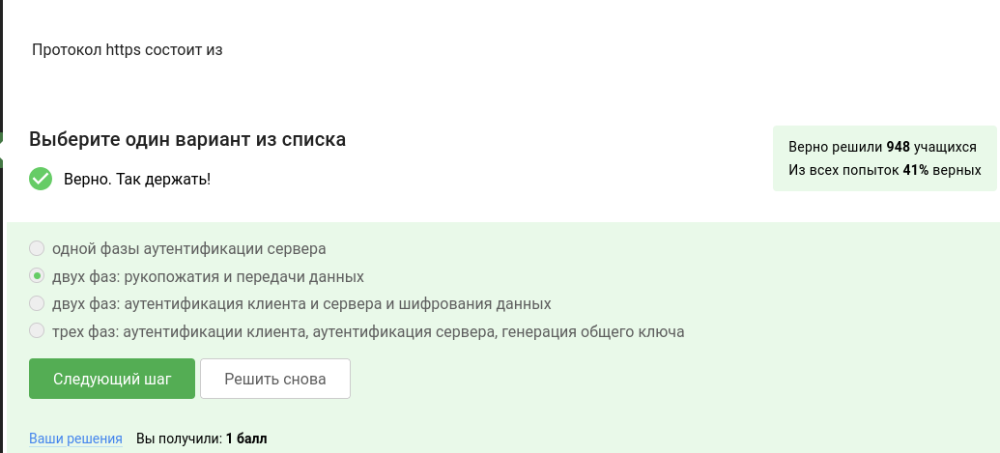{#fig:007 width=70%}

Чем определяется версия протокола TLS (рис. [-@fig:008]).

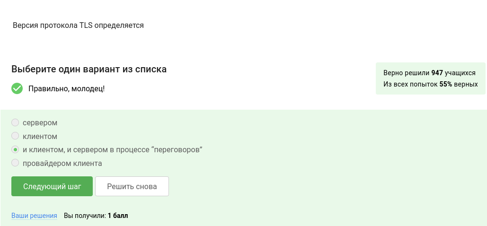{#fig:008 width=70%}

В фазе “рукопожатия” протокола TLS не предусмотрено... (рис. [-@fig:009]).

{#fig:009 width=70%}

Куки хранят... (рис. [-@fig:010]).

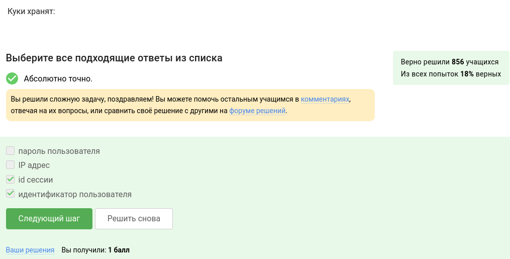{#fig:010 width=70%}

Куки не отслеживаются для ... (рис. [-@fig:011]).

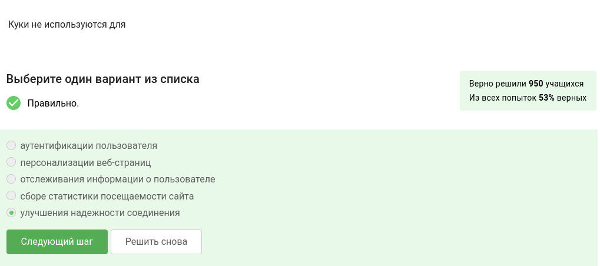{#fig:011 width=70%}

Куки генерируются... (рис. [-@fig:012]).

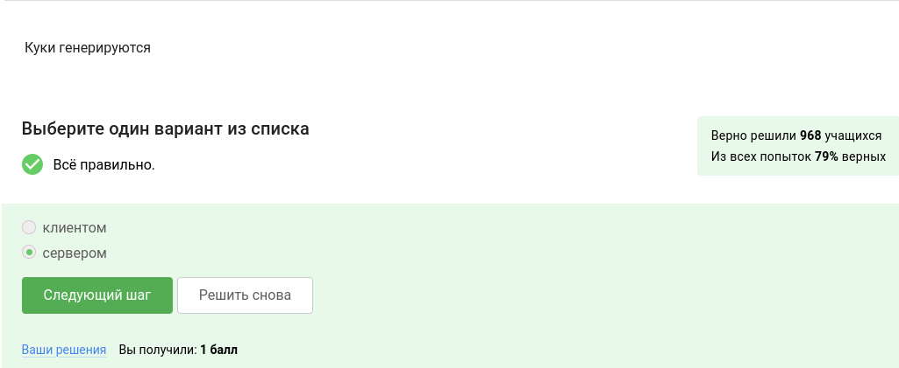{#fig:012 width=70%}

Где хранятся сессионные куки... (рис. [-@fig:013]).

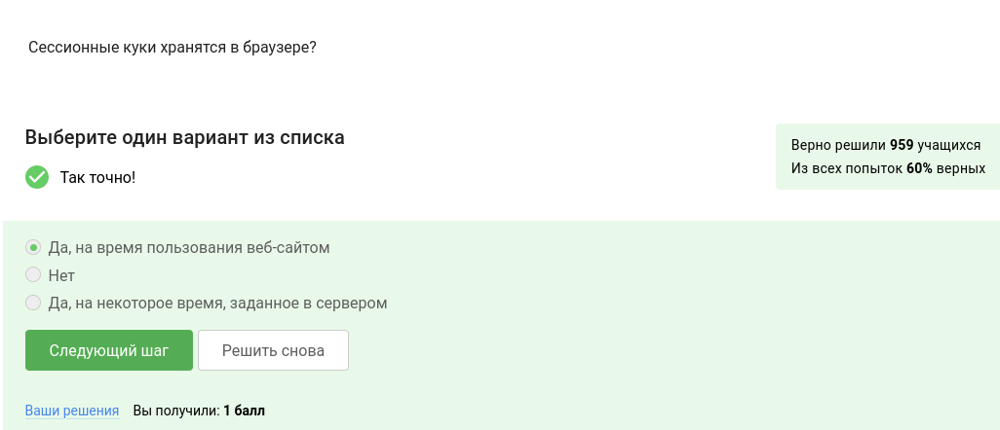{#fig:013 width=70%}

Сколько промежуточных узлов в луковой сети TOR? (рис. [-@fig:014]).

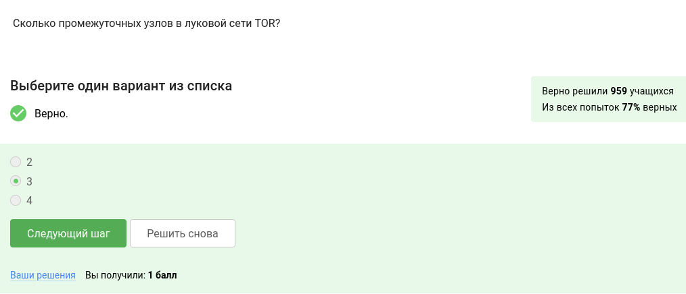{#fig:014 width=70%}

IP-адрес получателя известен (рис. [-@fig:015]).

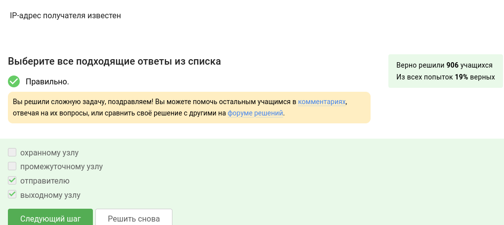{#fig:015 width=70%}

Отправитель генерирует общий секретный ключ (рис. [-@fig:016]).

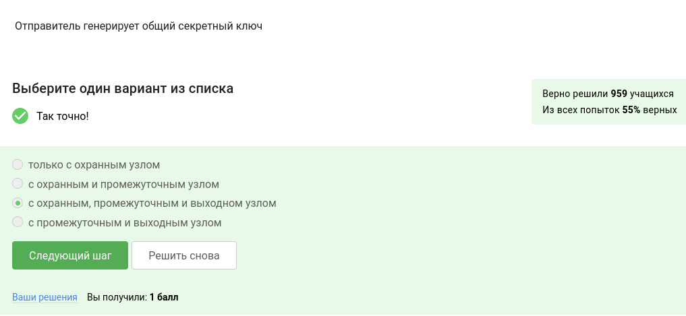{#fig:016 width=70%}

Браузер получателя (рис. [-@fig:017]).

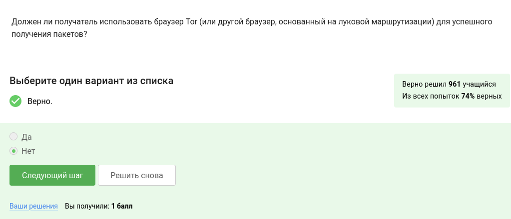{#fig:017 width=70%}

Wi-Fi - это (рис. [-@fig:018]).

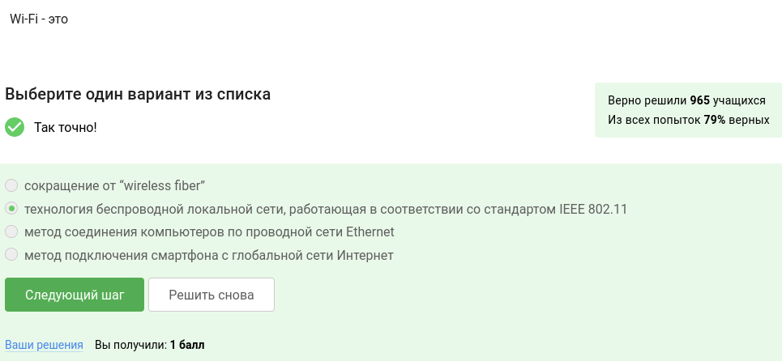{#fig:018 width=70%}

Уровень протокола Wi-Fi (рис. [-@fig:019]).

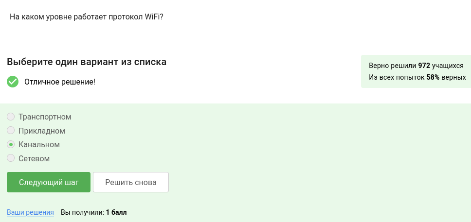{#fig:019 width=70%}

Небезопасный метод обеспечения шифрования и аутентификации в сети Wi-Fi (рис. [-@fig:020]).

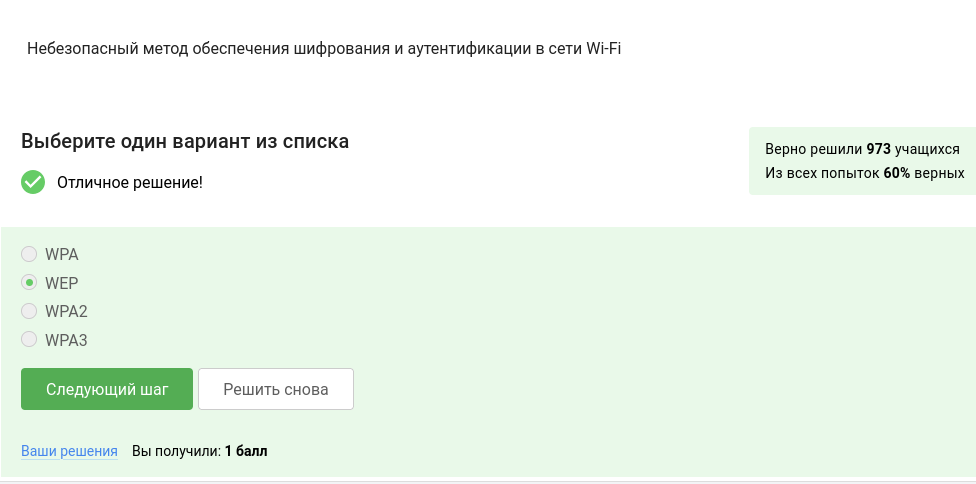{#fig:020 width=70%}

Данные между хостом сети (компьютером или смартфоном) и роутером (рис. [-@fig:021]).

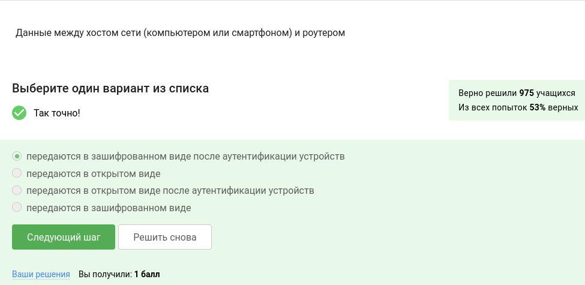{#fig:021 width=70%}

Для домашней сети для аутентификации обычно используется метод (рис. [-@fig:022]).

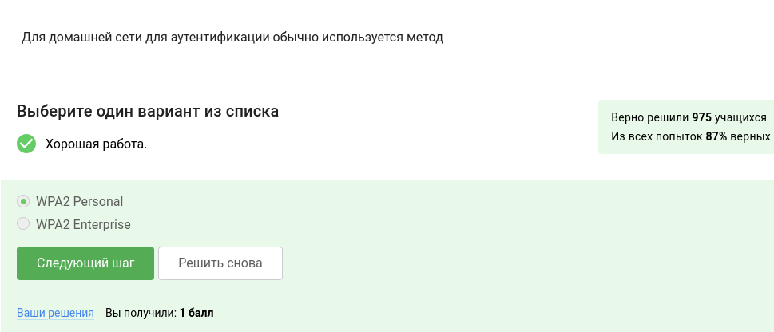{#fig:022 width=70%}

# Выводы

Проделаны задания,связаны с безопастностью в сети
